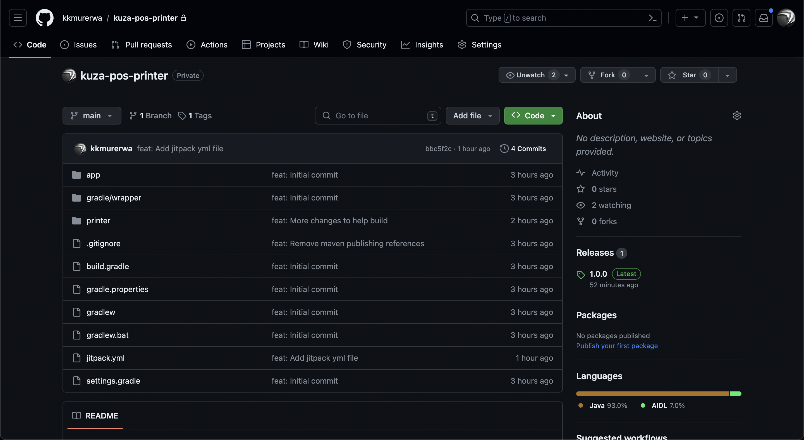
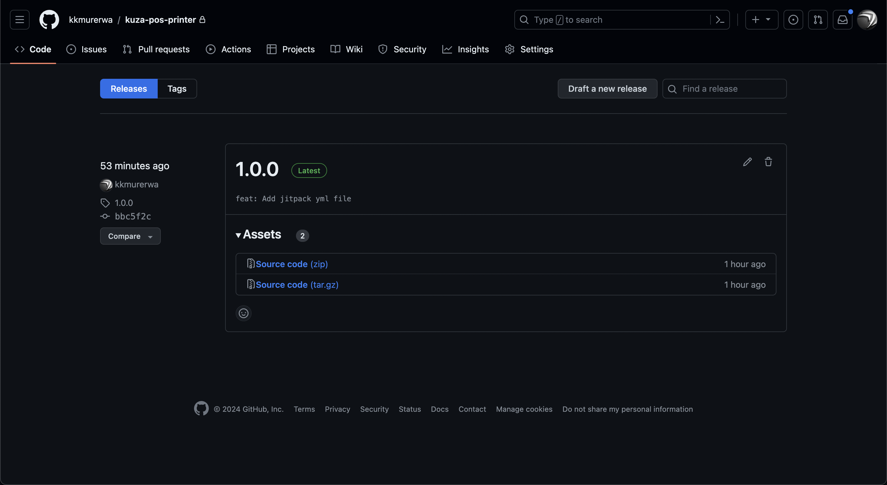
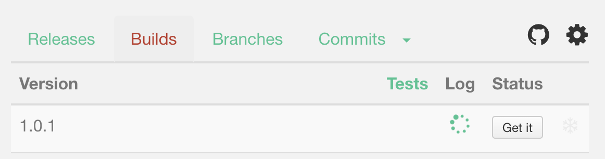

## Creating a new Release

1. Once your changes have been made, push the code to GitHub then head over to GitHub.

2. In the kuza-pos-printer page, click on the **Releases** section on the right panel. This should open the releases page.
   

3. Click the **_Draft a new realease_** button at the top right section of the window.
   

4. On the tag field, either create a new tag or reuse an existing tag. It is recommended that you create new tags for new releases. Tags should be incremental.
   

5. Type the release title. Ideally it should be the same as the release tag.

6. Optionally write a description for the new release and then click the **_Publish Release_** button to publish the new release.

## Publishing the release on JitPack

1. Open (Jitpack Private)[https://jitpack.io/private] to publish the new release.

2. Type `kkmurerwa/kuza-pos-printer` and click **Look Up** once the page is loaded.
   

3. In the status column of the releases tab, click on the **Get It** button. A spinner should appear as it compiles as shown below.
   

4. If the compile was successful, you should see a green log file as shown below and the library is now ready to be used in an app. If it failed, a red log file will be shown instead. Check the error and push a new build and redo the process.
   

## Adding Dependency to App

1. In your project level `build.gradle` file, add the `mavenCentral()` and `maven { url 'https://jitpack.io' }` dependencies;

   ```gradle
   allprojects {
       repositories {
           google()
           jcenter()
           mavenCentral()
           maven { url 'https://jitpack.io' }
       }
   }
   ```

2. In the app-level `build.gradle` file, add the following to the list of dependencies;

   ```gradle
   dependencies {
       // Other dependencies
       implementation "com.github.kkmurerwa:kuza-pos-printer:[versionNumber]"
   }
   ```

3. Import the PosPrinter class with the following import statement `import com.kuzasystems.printer.printerclasses.PosPrinter;` and perform a printing operation as in the example shown below;

   ```java
   public void universalPrinter(){
       String line;
       line="- - - - - - - - - - - - - - - - - - - - - -";
       List<PosPrinter.PosPrinterEntry> entries = new ArrayList<>();
       entries.add(new PosPrinter.PosPrinterEntry("****** REPRINTED ******",true, "CENTER","STRING"));
       entries.add(new PosPrinter.PosPrinterEntry("*** PARCELS RECEIPT ***",true, "CENTER","STRING"));
       entries.add(new PosPrinter.PosPrinterEntry(line,true, "CENTER","LINE"));
       entries.add(new PosPrinter.PosPrinterEntry("Tracking Number : 9256",true, "LEFT","STRING"));
       entries.add(new PosPrinter.PosPrinterEntry("Origin: Embu",false, "LEFT","STRING"));
       entries.add(new PosPrinter.PosPrinterEntry("Destination: NYERI LOWER",false, "LEFT","STRING"));
       entries.add(new PosPrinter.PosPrinterEntry("Sender: David",false, "LEFT","STRING"));
       new PosPrinter().print(this,entries);
   }
   ```

4. Call the `universalPrinter` method to perform a print in any of the supported POS devices.
